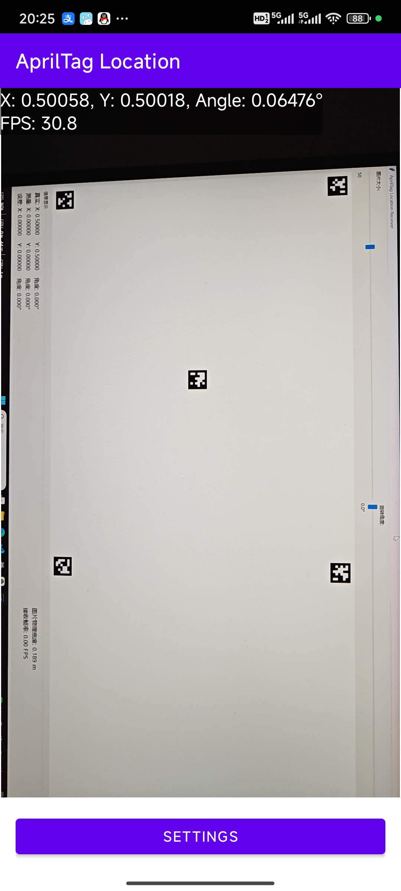
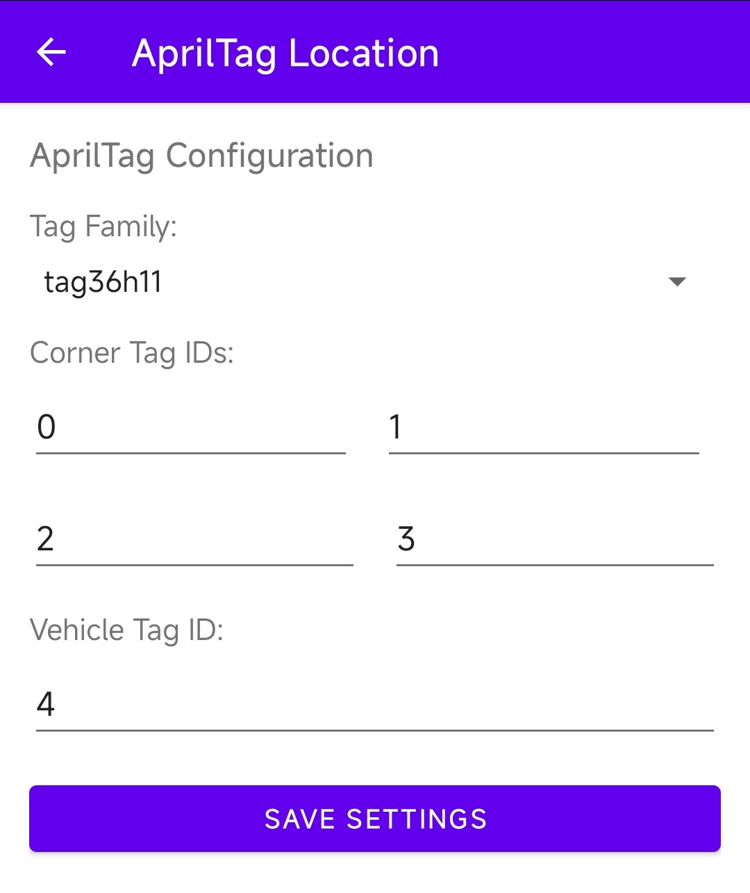

# AprilTag定位系统

## 项目介绍

这是一个基于AprilTag的实时位置与姿态估计系统，包含Android端的图像采集与处理以及PC端的数据接收与解析。该系统能够通过摄像头识别AprilTag标签，并计算出目标的位置(X,Y坐标)和角度，然后通过UDP协议将数据发送到指定设备进行进一步处理或可视化展示。

本项目使用通义灵码辅助开发。

### 主要功能

- 实时识别AprilTag标签

- 计算目标在场地中二维归一化坐标(X,Y)

- 计算目标的角度方向

- 实时帧率监控

- UDP数据传输

- 可配置的标签ID和类型

### 技术架构

- Android端使用CameraX API捕获图像

- 集成Apriltag库进行标签检测

- 使用UDP协议进行数据传输

- 支持多种AprilTag族类（tag16h5, tag25h9等）

## 使用教程

### 1. App使用

   - 打开应用后点击"设置"按钮

   - 配置AprilTag家族类型（如tag16h5）

   - 设置四个角点标签ID（用于建立坐标系）

   - 设置车辆标签ID（用于定位目标位置和角度）

主界面：



设置界面：



### 2. 信息接收

1. 确保Android设备与PC处于同一个局域网内

2. 信息使用UDP协议进行传输，类型为纯文本，格式为 `x,y,angle,timestamp`

    其中 **x、y** 为归一化坐标，**angle** 为角度方向，**timestamp** 为时间戳。

    坐标系为：**点1：(0,0)，点2：(1,0)，点3：(0,1)，点4：(1,1)。**

    角度为顺时针为正方向，AprilTag 码正立时的上方向与 **点1** 指向 **点2** 方向所形成的角。

3. 示例代码

    项目自带了一个 Python UDP 示例接收程序，可以接收Android端发送的位置和角度数据：

    > [docs/examples/udp_receiver.py](docs/examples/udp_receiver.py)

### 3. 模拟与误差分析

项目自带了一个 Python 示例程序，用于模拟实际的场地并计算位置和角度的误差：

> [docs/examples/analyze.py](docs/examples/analyze.py)

## 项目结构

### 项目整体结构

```
apriltag-location/
├── app/                          # Android应用模块
├── apriltag/                     # AprilTag原生库模块
├── docs/                         # 文档和示例代码目录
├── gradle/                       # Gradle包装器目录
├── build.gradle.kts              # 顶级构建配置文件
├── gradle.properties             # Gradle全局属性配置
├── gradlew                       # Linux/Mac下的Gradle包装器脚本
├── gradlew.bat                   # Windows下的Gradle包装器脚本
├── local.properties              # 本地属性配置（NDK路径等）
├── settings.gradle.kts           # 项目设置文件
├── README.md                     # 项目说明文档
├── STRUCTURE.md                  # 项目结构文档
├── udp_receiver.py               # Python UDP接收程序示例
└── .gitignore                    # Git忽略文件配置
```

### app模块结构

```
app/
├── build/                        # 构建输出目录
├── build.gradle.kts              # app模块构建配置
├── libs/                         # 第三方库存放目录
└── src/
    └── main/
        ├── AndroidManifest.xml   # Android应用配置文件
        ├── java/                 # Java/Kotlin源代码
        │   ├── com/
        │   │   └── example/
        │   │       └── apriltaglocation/    # 主要应用功能包
        │   │           ├── MainActivity.java       # 主Activity，负责相机控制和UI交互
        │   │           ├── SettingsActivity.java   # 设置Activity，配置AprilTag参数和网络设置
        │   │           ├── AprilTagAnalyzer.java   # AprilTag分析器，处理图像分析和坐标计算
        │   │           ├── AprilTagDetector.java   # AprilTag检测器，核心检测逻辑实现
        │   │           ├── NetworkSender.java      # 网络发送器，UDP数据传输实现
        │   │           └── MyApplication.java      # Application类，应用入口
        │   └── edu/
        │       └── umich/
        │           └── eecs/
        │               └── april/
        │                   └── apriltag/
        │                       ├── ApriltagDetection.java      # AprilTag检测接口
        │                       └── ApriltagNative.java         # AprilTag原生库封装
        └── res/                  # 资源文件
            ├── layout/           # 布局XML文件
            │   ├── activity_main.xml          # 主界面布局
            │   └── activity_settings.xml      # 设置界面布局
            ├── mipmap-anydpi-v26/ # 自适应图标
            ├── values/           # 字符串、颜色、样式等资源
            └── xml/              # 其他XML资源文件
```

## 其他

### 应用场景

- 第21届全国大学生智能车竞赛人工智能模型组定位

- 室内定位与导航

- 机器人定位与路径规划

- AR/VR空间定位

- 物体姿态估计

- 自动驾驶仿真测试

### 注意事项

- 确保AprilTag标签清晰可见且不过于倾斜

- 标签尺寸应适中，太小会导致识别困难

- 光线条件会影响识别效果，请确保照明充足

- 建议在稳定的网络环境下使用UDP传输