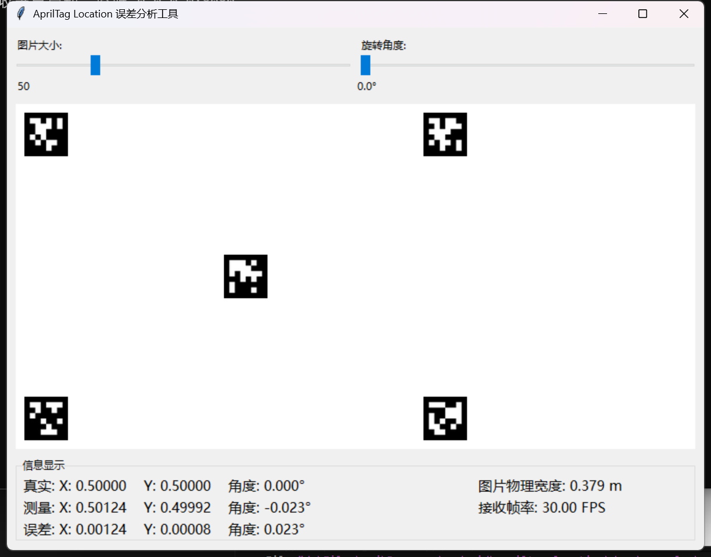

# 示例程序

## udp_receiver.py

> [udp_receiver.py](udp_receiver.py)

接收信息示例代码。

## analyze.py

> [analyzer.py](analyzer.py)

误差分析可视化工具。

`img/` 下包含了 5 个 AprilTag 标签的图像，标签族为 tag36h11，ID 为 0，1，2，3，4，用于测试识别效果。

可以在 [https://www.2weima.com/aruco.html](https://www.2weima.com/aruco.html) 网站生成 AprilTag 标签。注意：这个网站生成的标签都是旋转180度的，可以使用 [rotate_image.py](rotate_image.py) 脚本旋转。双击运行即可。

示例视频 ：

